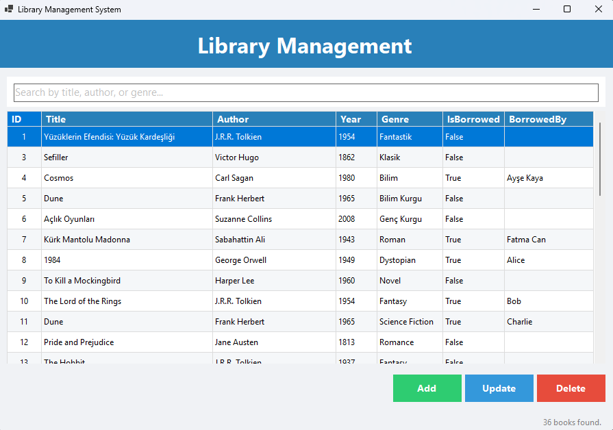

# 📚 LibraryManagementSystem

Mini Library Management application built with **C# WinForms**, **Entity Framework Core**, and **SQLite**.

---

## 🚀 Features

* Add, update, delete books
* Real-time search by title or author
* Modern UI with clean layout
* SQLite database + EF Core migrations
* Status feedback in UI

---

## 🖼️ Screenshots



---

## 🛠️ Tech Stack

* .NET 6 / .NET 8 (C# WinForms)
* Entity Framework Core
* SQLite

---

## 📂 Project Structure

```
LibraryManagementSystem/
│── Models/               # Book model class
│── Data/                 # DbContext & migrations
│── UI/                   # Forms (MainForm, Add/Update forms, etc.)
│── Database/             # (optional) local SQLite database file
│── screenshots/          # UI screenshots
│── LibraryManagementSystem.csproj
│── Program.cs
│── README.md
│── .gitignore
```

---

## ⚡ Getting Started

### Prerequisites

* Visual Studio 2022+
* .NET 6/8 SDK installed

### Run Locally

1. Clone this repo:

   ```bash
   git clone https://github.com/muludag718/LibraryManagementSystem.git
   ```

2. Open in Visual Studio

3. In `Package Manager Console`, run migrations (if needed):

   ```powershell
   Update-Database
   ```

4. Build and run the application (F5)

---

## 🎯 Usage

* When the app opens, you can **add a book** via the Add button
* Select a book in the list and use **Update** or **Delete**
* As you type in the search box, the list filters automatically

---

## ⚠️ Notes

* Do **not** commit local database file (`.db`) if you want everyone to start fresh
* Remove or ignore `bin/`, `obj/`, `.csproj.user` files

---

## 👨‍💻 Author

* **muludag718**
* GitHub: [muludag718](https://github.com/muludag718)
